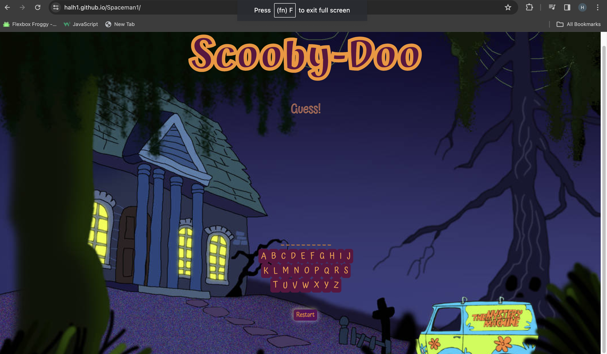
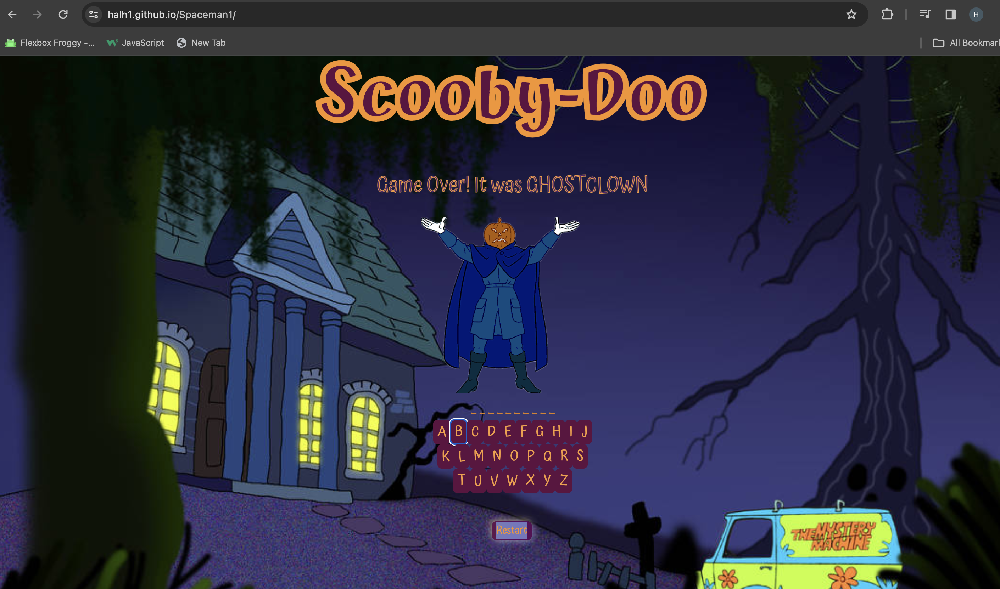
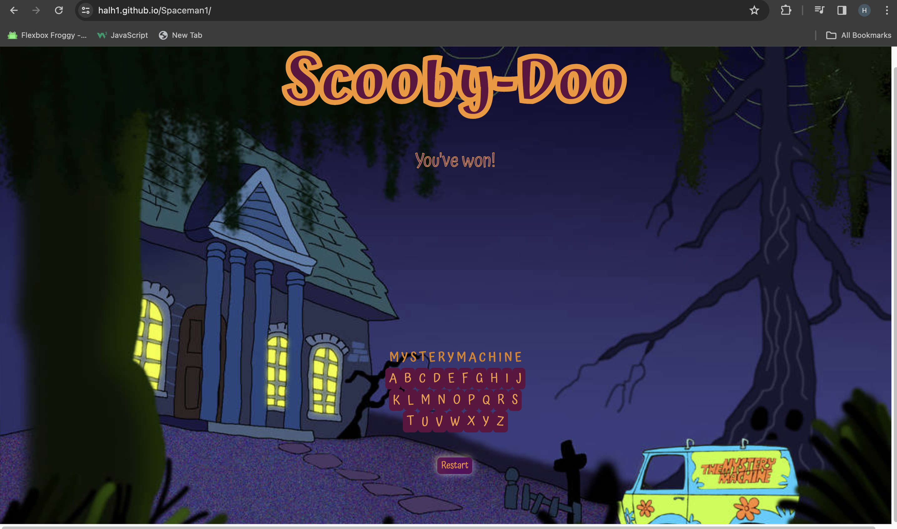

# Scooby-Doo Spaceman

## Game Background Information
This game is a Scooby Doo theme version of Spaceman which is the internet version of Hangman. The history of this game and it's creation is quite obsecure, some rumors say it was a game played by prisoners. _"Rite of Words and Life"_ is what they called it. Either way, our stacks are much lower and provide more then your average stick figures.  

## Screenshot of the Game

## Technologies Used

- JavaScript
- HTML
- CSS
- Git Hub

## Project Planning:

1) Define required constants
Array with the Keywords of the game

2) Define required variables used to track the state of the game
Will be tracking the keyboard
The amount of tries
Winner

3) Store elements on the page that will be accessed in code more than once in variables to make code more concise, readable and performant.
Hint button
Hidden element that will appear to announce win or lose
The buttons for the keyboard
Restart button

4) Upon loading the app should:
  - Initialize the state variables
Initialize the keyboard to make it functional and responsive to user
Initialize the 6 tries available to user
Initialize winner as null

  - Render those values to the page

  - Wait for the user to click on the keyboard 

5) Handle a player clicking a keyboard

6) Handle a player clicking the reset button

## How to play the game
The instructions are quite simple:
- The game will provide you with a keyboard.
- You have 6 tries to guess it currectly.
- Be strategic on where you want to start.
- If you are met with the a full Pumpkin Man you have surely lost. 
- Restart and try again. 
    *Best of luck!*
## Getting Started

[Click here to play Scooby-Doo Spaceman](https://halh1.github.io/Spaceman1/)

# Next Steps

- Planning to create two categories of word choices.
- Adding audio feature for Losses and Wins
- Adding a hint feature